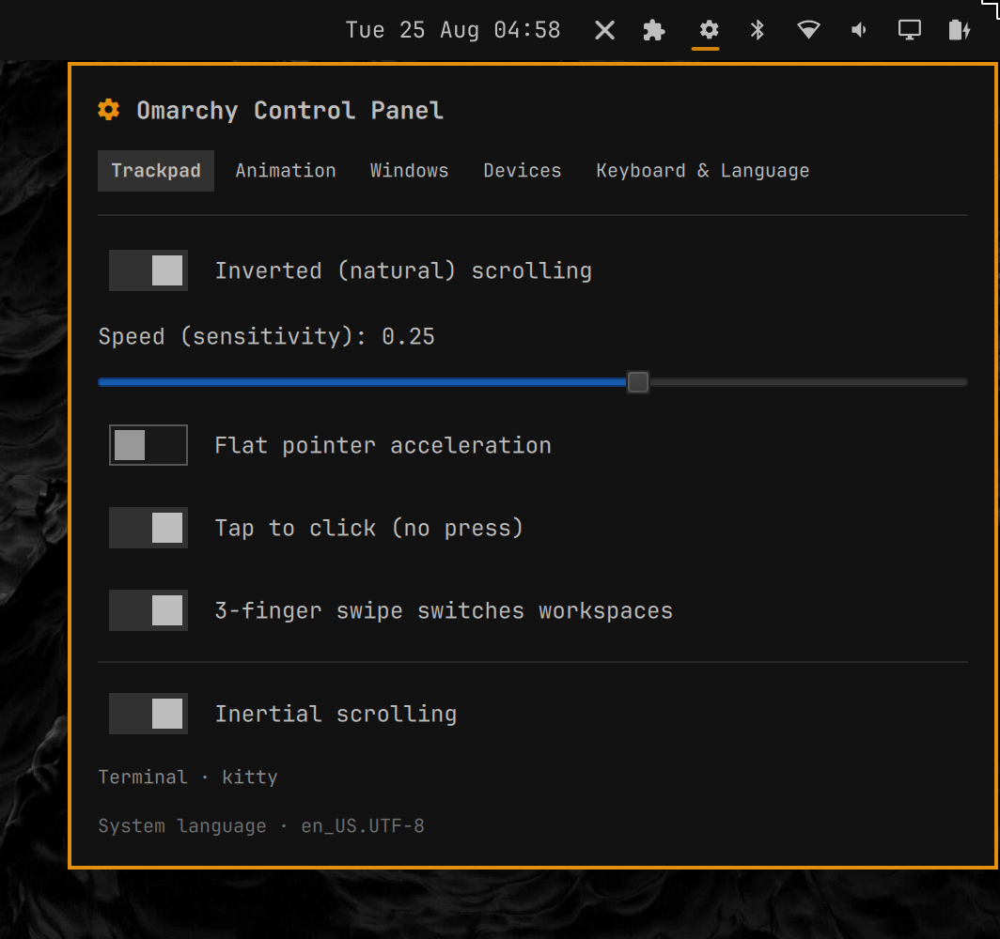
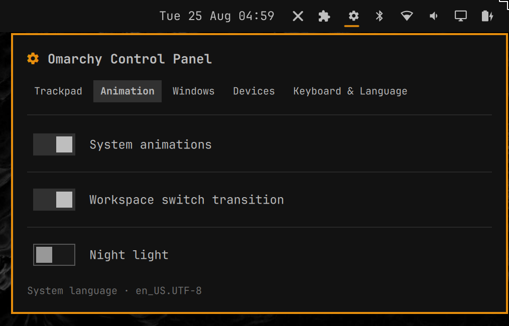
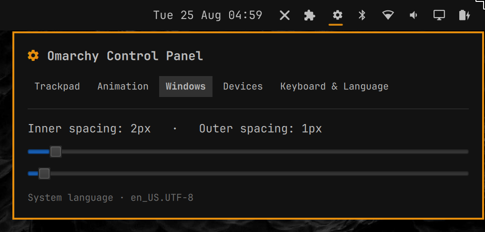
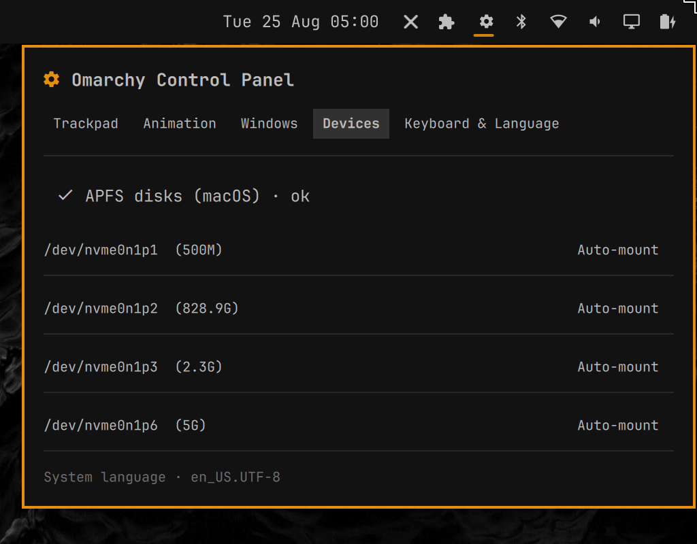
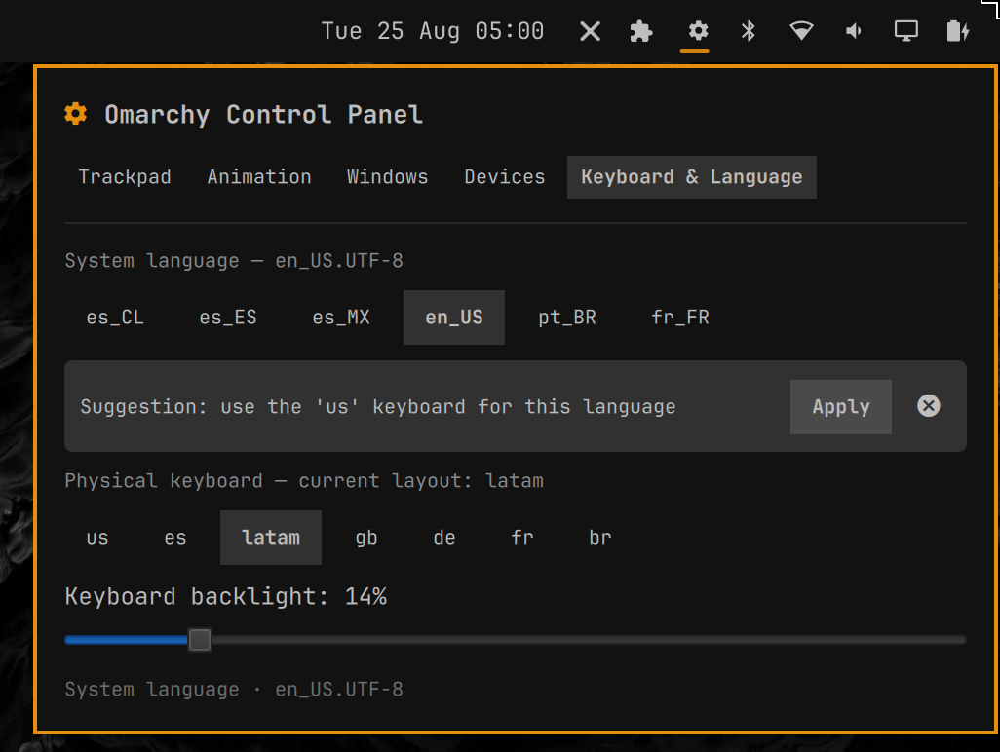
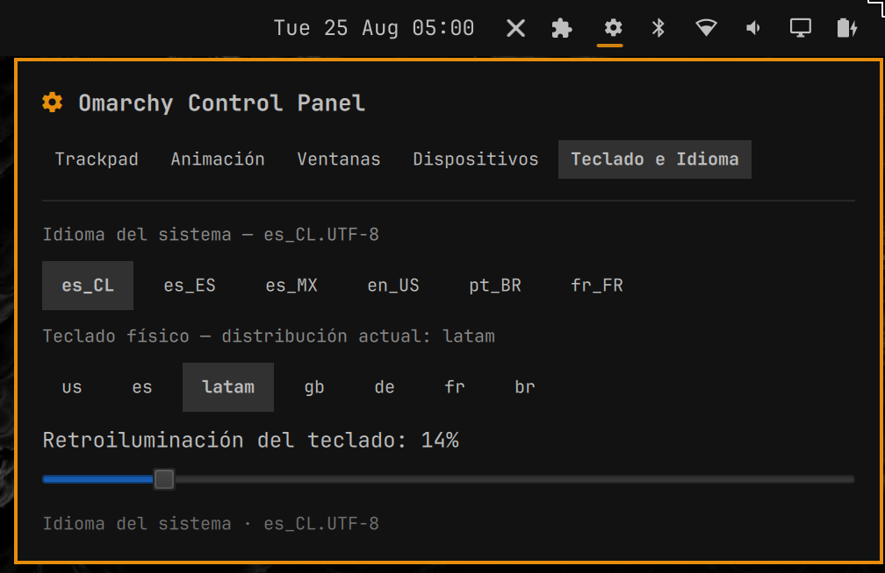

# Omarchy Control Panel

A system settings panel for **Omarchy / Hyprland**, built as an Omarchy shell plugin (Quickshell/QML). Familiar for users coming from macOS, useful for everyone.



## Features

A quick settings panel summoned from the Omarchy bar. It manages settings without touching `/usr/share/omarchy` and without sudo:

- **Trackpad / Mouse** (tuned for the Apple MTP multi-touch, which Hyprland classifies as a mouse):
  - Tap to click (no physical press)
  - Natural/inverted scrolling (per-device via `natural_scroll` + `scroll_factor`)
  - Inertial scrolling
  - 3-finger swipe to switch workspaces
- **Animations**: system animations, workspace transition, flat pointer acceleration, speed/sensitivity
- **Windows**: inner/outer gaps
- **Devices**: keyboard backlight, APFS (macOS disks)
- **Keyboard & Language**: physical layout, system language
- **Night light**, screenshot, and more

## Technical notes

- **External i18n**: all UI strings live in `i18n.json` (19 languages: en, es, pt, fr, de, it, nl, pl, ru, ja, ko, zh, ar, tr, sv, da, no, fi, cs). `en`, `es`, `pt`, `fr` are fully translated; the rest fall back to English until translated. The UI language follows the OS locale.
- **Persistence**: state is saved to `~/.config/hypr/control-panel.lua` (re-applied on Hyprland load) and to the plugin's prefs JSON.
- **No root**: the plugin never writes to `/usr/share/omarchy` and never asks for sudo; only essential changes via `hyprctl`.
- **No state flicker**: the UI syncs from the Lua file (source of truth) on open, avoiding the `hyprctl` read flip-flop on mouse-class devices.

## Installation

```bash
omarchy plugin add https://github.com/avillagran/omarchy-control-panel
```

Or clone manually into `~/.config/omarchy/plugins/io.github.avillagran.omarchy-control-panel/` and enable it.

## Structure

```
manifest.json        # plugin declaration (id, kinds, entry points)
BarWidget.qml        # bar widget that summons the panel
Panel.qml            # the settings panel
i18n.json            # UI strings in 19 languages
```

## Verification

Before publishing, run the smoke test:

```bash
~/.local/bin/verify-omarchy-control-panel.sh
```

It validates the manifest with `omarchy-plugin-validate`, checks for symlinks, JSON validity, and that the panel loads without errors.

## Screenshots







## License

MIT — see [LICENSE](LICENSE).
